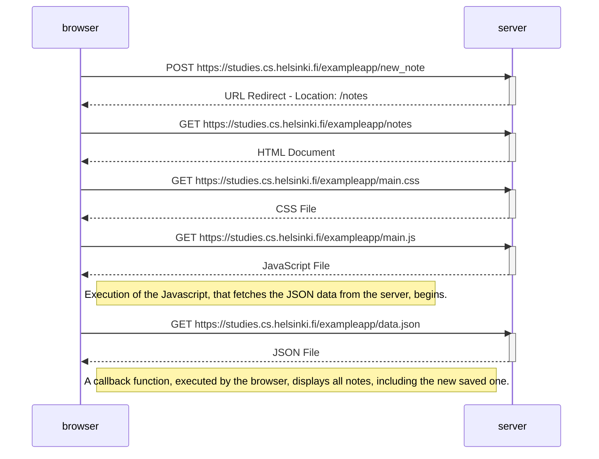

# New Note Diagram

```mermaid
sequenceDiagram
    participant browser
    participant server

   browser->>server: POST https://studies.cs.helsinki.fi/exampleapp/new_note
   activate server
   server -->> browser: URL Redirect - Location: /notes
   deactivate server

   browser->>server: GET https://studies.cs.helsinki.fi/exampleapp/notes
   activate server
   server-->>browser: HTML Document
   deactivate server

   browser->>server: GET https://studies.cs.helsinki.fi/exampleapp/main.css
   activate server
   server-->>browser: CSS File
   deactivate server

   browser->>server: GET https://studies.cs.helsinki.fi/exampleapp/main.js
   activate server
   server-->>browser: JavaScript File
   deactivate server

   Note right of browser: Execution of the Javascript, that fetches the JSON data from the server, begins.

   browser->>server: GET https://studies.cs.helsinki.fi/exampleapp/data.json
   activate server
   server-->>browser: JSON File
   deactivate server

   Note right of browser: A callback function, executed by the browser, displays all notes, including the new saved one.
```
