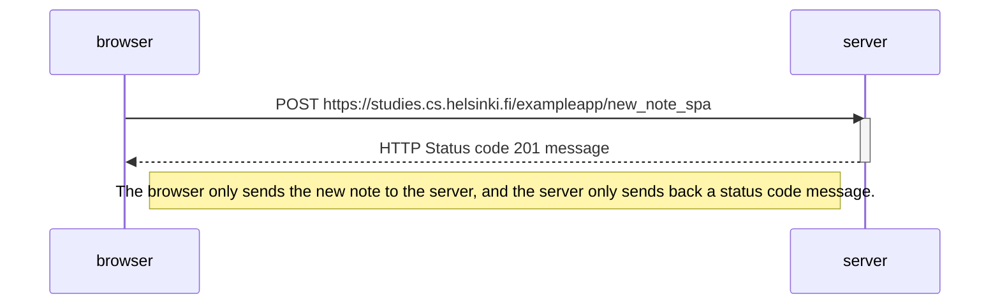

# New Note in Single Page Application Diagram

```mermaid
sequenceDiagram
    participant browser
    participant server

   browser->>server: POST https://studies.cs.helsinki.fi/exampleapp/new_note_spa
   activate server
   server-->>browser: HTTP Status code 201 message
   deactivate server

   Note right of browser: The browser only sends the new note to the server, and the server only sends back a status code message.
```
